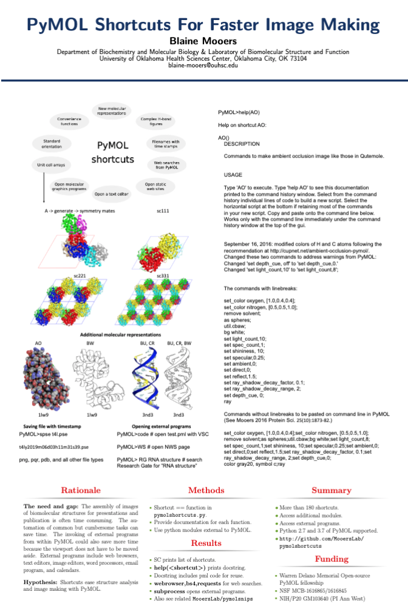

# Template for making compact poster in LaTeX

This repo contains  a template for a 24 inch by 36 inch poster in the portrait orientation.
The template is written in LaTeX.
It can be edited on-line at the Overleaf website.
It uses the beamer document class and the beamposter package.
It should be processed with the lualatex compiler.
I save it as a PDF, put it on a thumb drive, and print it for under \$35 at Office Depot.
This template saves a lot time and reduces the fuss and mess around preparing a poster.

This small size and portrait orientation accommodates most scientific poster presentation venues.
It attracts more visitors than average because its small size limits the amount of data that can be presented and thereby reduces the probability of overwhelming the visitor.
This poster is more of a billboard that draws in visitors, so that you can initiate the conversation about your research story. 

The template takes a single 24 x 24 inch image for the central region of the poster.
I usually prepare the image in PowerPoint, Inkscape, or Gimp and save it as a PNG or PDF file.
The image may contain multiple figure panels with or without figure legends.
I do the positioning of figure panels outside of LaTeX.
The bottom of the poster has a minimal amount of text, which no one ever concentrates long enough in the dim of the convention hall to read completely. 

The preparation of the content for the figure panels may take several days.
The assembly of the panels in the PowerPoint slide takes 1-2 hours.
The editing of the text in the tex file takes 1-3 hours.
After the figure panel preparation, the poster can be be assembled in one afternoon.

My lab has been using this format for posters for at least four years.
Summer students pick up quickly how to edit the text on Overleaf.
It was time to share this template.

## Instructions

- Download all of the files (git clone https://github.com/MooersLab/posterInLaTeX.git).
- Swamp the PDF with your image file.
- Change the Title and other text in a text editor or on Overleaf to suit your needs.
- Run lualatex on the tex file in the presence the style (.sty) files to compile.
- Take the resulting PDF to a poster printing service.
